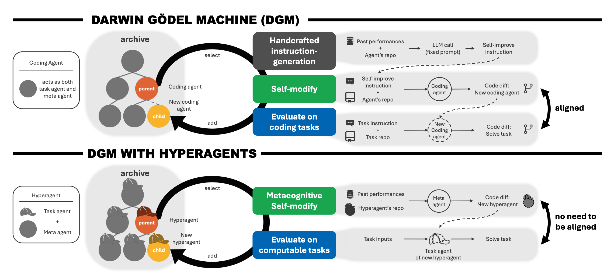

<div align="center">

<!-- Logo/Banner placeholder - uncomment and add your image -->
<!--  -->

<h1>HyperAgents</h1>

<p><strong>Self-referential agents that improve not only how they solve tasks, but how they improve themselves</strong></p>

<p>
<a href="LICENSE.md"></a>
<a href="https://arxiv.org/abs/2603.19461"></a>
<a href="https://ai.meta.com/research/publications/hyperagents/"></a>
<a href="https://x.com/jennyzhangzt/status/2036099935083618487"></a>
</p>

---

</div>

## What is HyperAgents?

<div align="center">

<br>
<em><strong>Figure:</strong> The Darwin Gödel Machine with Hyperagents (DGM-H) extends the DGM beyond coding tasks. (Top) In the original DGM, a fixed, handcrafted instruction-generation mechanism drives self-improvement — recursive improvement depends on alignment between coding performance and self-modification ability. (Bottom) In the DGM-H, the task agent and meta agent are combined into a single editable program (a hyperagent), making the meta-level improvement mechanism itself subject to modification. This enables metacognitive self-modification across any computable task.</em>
</div>

<br>

Most self-improving AI systems rely on a **fixed, handcrafted meta-level mechanism** — a higher-level process that modifies the base agent but is itself never modified. This creates a fundamental bottleneck: the system can only improve within the boundaries defined by its static improvement procedure.

**HyperAgents** removes this bottleneck. A *hyperagent* is a single, self-referential program that unifies two roles:

- **Task agent** — solves a given task (e.g., writing code, reviewing a paper, designing a reward function)
- **Meta agent** — modifies the codebase to produce better agents in future generations

Because both roles live in the same editable program, the meta agent can modify *itself*. This means a hyperagent can improve not only **how it solves tasks**, but also **how it generates future improvements** — a property called **metacognitive self-modification**.

We instantiate this framework by extending the [Darwin Gödel Machine](https://arxiv.org/abs/2505.22954) (DGM) into **DGM-Hyperagents (DGM-H)**. The DGM-H retains the DGM's open-ended, population-based exploration (maintaining an archive of progressively improving agents) while making the entire meta-level mechanism editable. By allowing the improvement procedure itself to evolve, the DGM-H eliminates the assumption of domain-specific alignment between task performance and self-modification skill, and can potentially support self-accelerating progress on **any computable task**.

### How It Works

```
┌─────────────────────────────────────────────────────────────┐
│                    DGM-H Generation Loop                    │
│                                                             │
│  1. SELECT parent hyperagent from archive                   │
│  2. SELF-MODIFY via meta agent (edits its own code)         │
│  3. EVALUATE the new hyperagent on target task(s)           │
│  4. ADD to archive if successful                            │
│  5. REPEAT — building a growing archive of stepping stones  │
│                                                             │
│  Key: The meta agent that drives step 2 is ITSELF editable  │
│  by the same process, enabling recursive self-improvement   │
└─────────────────────────────────────────────────────────────┘
```

Each generation runs inside an isolated **Docker container**. The meta agent uses LLM-powered tools (bash execution, file editing) to inspect past evaluation results and modify any part of the hyperagent's codebase. Changes are tracked as git diffs and accumulated across lineages, so improvements compound over generations.

### Key Results

Across diverse domains, DGM-H demonstrates substantial and generalizable self-improvement:

| Domain | Task | Metric | Initial | DGM-H | Notes |
|---|---|---|---|---|---|
| **Coding** (Polyglot) | Edit code repos from natural language instructions | Accuracy | 0.084 | 0.267 | Comparable to the original DGM, despite not being handcrafted for coding |
| **Paper Review** | Predict accept/reject for ML conference papers | Accuracy | 0.0 | 0.710 | Outperforms the open-source AI-Scientist-v2 baseline (0.630) |
| **Robotics Reward Design** | Design reward functions to train quadruped locomotion | Fitness | 0.060 | 0.372 | Surpasses the default reward function baseline (0.348) |
| **Olympiad Math Grading** | Grade IMO-level math solutions | Accuracy | 0.0 | 0.700 | Outperforms ProofAutoGrader (0.670) from IMO-GradingBench |

Beyond raw task performance, the DGM-H also improves **how it improves**:

- **Meta-level transfer**: Self-improvement strategies learned on paper review + robotics transfer to Olympiad math grading, achieving imp@50 of 0.630 — despite never training on math
- **Compounding gains**: Self-improvements from prior runs accumulate when continued in new domains
- **Emergent capabilities**: The DGM-H autonomously develops persistent memory, performance tracking, and structured decision frameworks without being explicitly told to

## Setup

### Prerequisites

- Python 3.12
- Docker
- API keys for at least one supported LLM provider

### Installation

```bash
# Clone the repository
git clone https://github.com/facebookresearch/Hyperagents.git
cd Hyperagents

# Set up API keys in a .env file
cat <<EOF > .env
OPENAI_API_KEY=...
ANTHROPIC_API_KEY=...
GEMINI_API_KEY=...
EOF

# Install system dependencies (Fedora/RHEL)
sudo dnf install -y python3.12-devel graphviz graphviz-devel cmake ninja-build bzip2-devel zlib-devel ncurses-devel libffi-devel

# Create virtual environment and install packages
python3.12 -m venv venv_nat
source venv_nat/bin/activate
pip install -r requirements.txt
pip install -r requirements_dev.txt

# Build the Docker container (used for sandboxed agent execution)
docker build --network=host -t hyperagents .

# Initialize baseline agents and run initial evaluations
bash ./setup_initial.sh
```

## Running HyperAgents

```bash
# Run the main generation loop on a domain
python generate_loop.py --domains <domain>

# Supported domains:
#   paper_review          - ML conference paper accept/reject prediction
#   genesis_go2walking    - Quadruped robotics reward function design
#   imo_grading           - IMO-level math solution grading
#   polyglot              - Code editing from natural language instructions
#   balrog                - Dungeon exploration game agents
#   search_arena          - Search result ranking
#   imo_proof             - IMO proof grading

# Multi-domain optimization (joint evolution)
python generate_loop.py --domains paper_review genesis_go2walking

# Run the meta agent manually on a repo
python run_meta_agent.py

# Run the task agent on a specific task
python run_task_agent.py
```

By default, outputs are saved in the `outputs/` directory. Each generation produces:
```
outputs/
├── archive.jsonl              # Index of all valid generations
├── gen_initial/               # Baseline agent + evaluation
├── gen_0/                     # First evolved generation
│   ├── metadata.json          # Parent ID, patches, scores, config
│   ├── model_patch.diff       # Code changes made by the meta agent
│   ├── generate.log           # Full generation log
│   └── paper_review_eval/     # Domain-specific evaluation results
│       ├── predictions.csv
│       ├── report.json
│       └── report_ensemble.json
├── gen_1/
│   └── ...
└── ...
```

## Repository Structure

```
HyperAgents/
├── generate_loop.py        # Main evolutionary loop: parent selection → self-modify → evaluate → archive
├── meta_agent.py           # Meta agent: uses LLM tools to modify the hyperagent's codebase
├── task_agent.py           # Task agent: solves domain-specific tasks via LLM calls
├── run_meta_agent.py       # Script to run the meta agent with git diff tracking
├── run_task_agent.py       # Script to run the task agent on individual tasks
├── select_next_parent.py   # Parent selection from the archive (score-proportional + exploration)
├── ensemble.py             # Ensemble voting across top agents for supported domains
├── setup_initial.sh        # Initialize baseline agents and run first evaluations
├── Dockerfile              # GPU-enabled container with all dependencies (CUDA, Genesis, etc.)
│
├── agent/                  # LLM agent framework
│   ├── base_agent.py       # Abstract base class for all agents
│   ├── llm.py              # Multi-provider LLM interface (OpenAI, Anthropic, Gemini via litellm)
│   ├── llm_withtools.py    # Tool-use wrapper for LLM agents
│   └── tools/              # Agent tools (bash execution, file editing)
│
├── domains/                # Domain-specific evaluation harnesses and datasets
│   ├── harness.py          # Unified evaluation interface across all domains
│   ├── report.py           # Evaluation report generation and metric computation
│   └── [domain configs]    # Per-domain task loading and scoring
│
├── baselines/              # Pre-built baseline implementations for comparison
│   ├── ai_reviewer/        # LLM-based paper reviewer
│   ├── dgm/                # Darwin Gödel Machine baseline
│   ├── genesis_go2walking/  # Robotics reward design baseline
│   ├── imo_grading/        # Math grading baseline (ProofAutoGrader)
│   ├── imo_proof/          # Math proof baseline
│   └── sft_openai/         # Supervised fine-tuning baseline
│
├── analysis/               # Plotting and statistical analysis scripts
│   ├── plot_progress.py    # Visualize improvement over generations
│   ├── plot_comparison.py  # Compare multiple experimental runs
│   ├── plot_testevals.py   # Test set evaluation analysis
│   └── visualize_archive.py # Archive genealogy visualization
│
└── utils/                  # Shared utilities
    ├── gl_utils.py         # Generation loop helpers (scoring, archive, lineage tracking)
    ├── docker_utils.py     # Docker container lifecycle and file transfer
    ├── git_utils.py        # Git operations for change tracking
    ├── domain_utils.py     # Domain configuration (metrics, splits, staged eval params)
    ├── common.py           # JSON extraction, file I/O helpers
    └── thread_logger.py    # Thread-safe logging for parallel evaluation
```

## Supported LLMs

HyperAgents uses [litellm](https://github.com/BerriAI/litellm) for multi-provider LLM support:

| Provider | Models |
|---|---|
| Anthropic | Claude Sonnet, Claude Haiku, Claude 3.5 Sonnet |
| OpenAI | GPT-4o, o3, o3-mini, GPT-5 variants |
| Google | Gemini 2.5 Pro, Gemini Flash |

## Experiment Logs

The experiment logs from the paper are stored as a multi-part ZIP archive. To extract them, ensure all `.z01`, `.z02`, etc., files are in the same directory as the `.zip` file, then run:

```bash
zip -s 0 outputs_os_parts.zip --out unsplit_logs.zip
unzip unsplit_logs.zip
```

## Safety Considerations

> [!WARNING]
> This repository involves executing untrusted, model-generated code. All experiments are conducted within carefully sandboxed Docker environments with enforced resource limits (timeouts, restricted internet access). These measures are designed to prevent unintended side effects and contain failures.
>
> While it is highly unlikely that generated code will perform overtly malicious actions under current settings, it may still behave destructively due to limitations in model capability or alignment. Human oversight is maintained throughout all experiments. By using this repository, you acknowledge and accept these risks.
>
> For a detailed discussion of the safety implications of open-ended self-improving systems, see [Section 6 and Appendix F](https://arxiv.org/abs/2603.19461) of the paper.

## Citing

If you find this project useful, please consider citing:

```bibtex
@misc{zhang2026hyperagents,
      title={Hyperagents},
      author={Jenny Zhang and Bingchen Zhao and Wannan Yang and Jakob Foerster and Jeff Clune and Minqi Jiang and Sam Devlin and Tatiana Shavrina},
      year={2026},
      eprint={2603.19461},
      archivePrefix={arXiv},
      primaryClass={cs.AI},
      url={https://arxiv.org/abs/2603.19461},
}
```

## License

This project is licensed under [CC BY-NC-SA 4.0](LICENSE.md).
